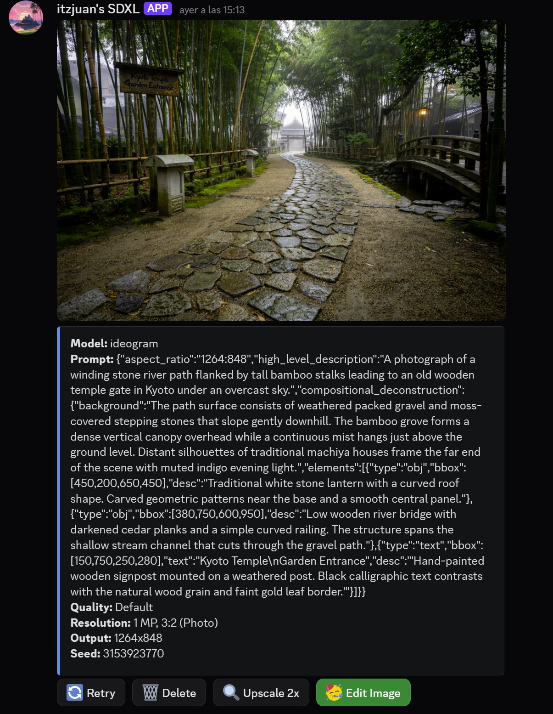

# Juan's ComfyUI Discord Bot

A Discord bot that exposes ComfyUI image generation workflows as slash commands. Users can generate text-to-image, image-to-image edits, upscaling, and LLM-assisted prompt engineering directly from Discord channels.

<p></p>

---

## Features


| Feature                                                   | Description                                                                                                                                                |
| --------------------------------------------------------- | ---------------------------------------------------------------------------------------------------------------------------------------------------------- |
| 🎨 **Ideogram (`/ideogram`)**                             | Generate images with Ideogram 4. Supports prompt, seed, quality preset, megapixels, and aspect ratio.                                                      |
| 🎨 **SDXL (`/sdxl`)**                                     | Generate images with SDXL. Supports prompt, negative prompt, seed, steps, width/height, and CFG. Can use any checkpoint in ComfyUI's `models/checkpoints` folder via the `model` parameter.                  |
| ✏️ **Image-to-Image (`/img2img`)**                        | Edit one image or combine two images using Flux 2 Klein 4B Base. Supports cfg, steps, sampler, megapixels.                                                 |
| 🔍 **Upscale (`/upscale`)**                               | Upscale an attached image using SDXL, SeedVR2, or FlashVSR. SDXL shows a picker to use any checkpoint in `models/checkpoints`. Supports custom scale factor, prompt, negative, and strength.                                  |
| 💬 **Prompt Generation (`/gen_prompt`)**                  | Converts a natural-language idea into a structured Ideogram 4 JSON caption using an LLM (OpenAI-compatible endpoint). Includes reasoning-effort selection. |
| 📋 **LLM Model List (`/llm_models`)**                     | Lists all models available on the configured LLM endpoint.                                                                                                 |
| 📊 **Progress Bar**                                       | Live progress bar updated via ComfyUI WebSocket during generation.                                                                                         |
| 🕶️ **Stealth Mode**                                      | Ephemeral messages visible only to the requesting user.                                                                                                    |
| 🔁 **Retry / Delete Buttons**                             | Persistent buttons on every output message. Retry re-rolls the seed; Delete removes the message (owner or admins can delete any).                          |
| 🚀 **Upscale 2x Button**                                  | One-click upscale of any generated image, with model picker. For SDXL images, the SDXL option reuses the checkpoint the image was created with; for non-SDXL images the SDXL option is hidden (SDXL upscale works best with SDXL checkpoints).                                                                                               |
| 🖌️ **Edit Image Button**                                 | Opens a modal to run the Flux 2 Klein 4B single-image edit workflow on an output.                                                                          |
| ⚙️ **Per-User Settings (`/settings`, `/reset_settings`)** | Saved defaults for prompts, CFG, steps, sampler, quality, megapixels, aspect ratio, and stealth. Stored in SQLite.                                         |
| 🛡️ **NSFW Guardrail**                                    | Keyword-based prompt filter + CPU ONNX image classifier. NSFW content is blocked unless the channel is Discord-marked NSFW.                                |
| 👮 **Moderation**                                         | Ban/unban users, promote/demote admins, view user list. Stored in SQLite.                                                                                  |
| 🧹 **Flush (`/flush`)**                                   | Unloads all ComfyUI models and execution cache to free VRAM/RAM.                                                                                           |
| 🛠️ **Admin Panel (`/admin`)**                            | Owner can restart the bot, manage admins, and manage bans.                                                                                                 |
| ⏱️ **Cooldown**                                           | Per-user 20-second minimum interval between generations.                                                                                                   |
| 💾 **Memory Management**                                  | Automatically frees ComfyUI memory when switching between workflows, or when choosing a different checkpoint (`model`) for `/sdxl`. Reusing the same checkpoint causes no flush.                                                                                       |


---

## Commands Reference

### `/ideogram`


| Parameter      | Description                                |
| -------------- | ------------------------------------------ |
| `prompt`       | Text prompt (required)                     |
| `seed`         | Seed (optional)                            |
| `quality`      | Ideogram preset: Turbo / Default / Quality |
| `megapixels`   | Target resolution in MP                    |
| `aspect_ratio` | Aspect ratio preset                        |
| `stealth`      | Ephemeral output                           |


### `/sdxl`


| Parameter          | Description                |
| ------------------ | -------------------------- |
| `prompt`           | Text prompt (required)     |
| `negative`         | Negative prompt            |
| `seed`             | Seed (optional)            |
| `steps`            | Sampling steps             |
| `width` / `height` | Dimensions, multiple of 64 |
| `cfg`              | Guidance scale             |
| `model`            | Checkpoint filename in ComfyUI's `models/checkpoints` folder (optional; defaults to the workflow's checkpoint) |
| `stealth`          | Ephemeral output           |
> **Any checkpoint:** Pass any file name present in ComfyUI's `models/checkpoints` folder via `model` to generate with a different checkpoint instead of the workflow's default. The bot verifies the file exists before running the workflow, and the embed reports the checkpoint actually used. Switching to a different checkpoint frees ComfyUI memory; reusing the same checkpoint does not. If the workflow's default checkpoint (e.g. `SDXL.safetensors`) is missing from `models/checkpoints`, the bot automatically falls back to an available checkpoint (preferring one whose name contains "sdxl") and the embed reports the checkpoint actually used. The `model` parameter uses dynamic autocomplete: as you type, the bot filters the live checkpoint list (cached for 60 seconds), so newly added checkpoint files appear without a bot restart or slash-command re-sync.


### `/gen_prompt`


| Parameter      | Description                          |
| -------------- | ------------------------------------ |
| `prompt`       | Natural-language idea to convert     |
| `megapixels`   | Target resolution in MP              |
| `aspect_ratio` | Aspect ratio preset                  |
| `model`        | LLM model to use (see `/llm_models`) |
| `max_tokens`   | Max tokens (optional)                |
| `temperature`  | LLM temperature 0–1 (optional)       |


After selecting the reasoning effort, the bot composes the prompt via the Ideogram prompt-gen workflow, calls the LLM, and posts the resulting JSON caption.

### `/upscale`


| Parameter  | Description                            |
| ---------- | -------------------------------------- |
| `model`    | `sdxl`, `seedvr2`, or `flashvsr`       |
| `image`    | Image to upscale (attach from gallery) |
| `prompt`   | Optional guidance prompt               |
| `negative` | Optional negative prompt               |
| `strength` | Denoise strength 0–1 (SDXL only)       |
| `scale`    | Upscale factor (e.g. 2 or 3)           |
| `stealth`  | Ephemeral output                       |

> **SDXL checkpoint picker:** Choosing `sdxl` uploads your image, then shows an ephemeral picker listing every checkpoint in ComfyUI's `models/checkpoints` folder (plus a **Default** option that uses the workflow's own checkpoint). Selecting a checkpoint runs the SDXL upscale workflow with that checkpoint; the embed reports the checkpoint actually used. Switching to a different checkpoint frees ComfyUI memory; reusing the same one does not.


### `/img2img`


| Parameter    | Description                                           |
| ------------ | ----------------------------------------------------- |
| `workflow`   | `single` (1 image edit) or `multi` (2 images combine) |
| `image`      | First input image                                     |
| `prompt`     | Description of the desired edit                       |
| `image2`     | Second input image (required for multi)               |
| `cfg`        | CFG (optional)                                        |
| `steps`      | Steps (optional)                                      |
| `sampler`    | Sampler name (optional)                               |
| `megapixels` | Target MP (optional)                                  |
| `stealth`    | Ephemeral output                                      |


### `/settings` / `/reset_settings`

View or update per-user defaults:

- `positive_prompt`, `negative_prompt`
- `cfg`, `steps` (SDXL)
- `ideogram_quality`, `ideogram_megapixels`, `ideogram_aspect_ratio`
- `img2img_cfg`, `img2img_steps`, `img2img_sampler`, `img2img_megapixels`
- `stealth` (default privacy)
- `sdxl_checkpoint`

### `/flush`

Unloads all models and execution cache from ComfyUI.

### `/admin`

Owner/admin panel: restart bot, promote/demote admins, ban/unban users, view ban list.

---

## Architecture

```
┌──────────────┐     HTTP API      ┌──────────────┐
│  Discord     │ ────────────────► │   ComfyUI    │
│   Bot        │ ◄──────────────── │  (server)    │
│ (main.py)    │   WebSocket       └──────────────┘
│              │
│              │ ──── HTTP (v1/chat/completions) ────► LLM endpoint
│              │
│ SQLite DBs:  │
│ • user_settings.db
│ • generations.db
│ • moderation.db
└──────────────┘
```

Key modules:


| File                  | Role                                                                                        |
| --------------------- | ------------------------------------------------------------------------------------------- |
| `main.py`             | Entry point: inits the SQLite DBs, seeds the owner, and runs the bot `(python main.py)`     |   
| `bot.py`              | Shared bot instance: creates the Bot, imports the cogs (slash commands), and defines `on_ready`                                |
| `comfyui_client.py`   | Async HTTP/WS client for ComfyUI (`/prompt`, `/history`, `/view`, `/upload/image`, `/free`) |
| `config_loader.py`    | Loads `config.yaml` (auto-generates it with defaults if missing)                  |
| `user_settings.py`    | Per-user defaults (SQLite)                                                                  |
| `generation_store.py` | Persisted generation params per message (SQLite)                                            |
| `moderation.py`       | Admin/ban lists (SQLite)                                                                    |
| `nsfw_guard.py`       | Keyword + ONNX image NSFW classifier                                                        |


---

## Setup

### 1. Prerequisites

- **Python 3.10+**
- **ComfyUI** running and accessible over HTTP (default port 8188)
- **A GPU** (NVIDIA recommended) with sufficient VRAM
- **A Discord bot token** (create one at [https://discord.com/developers/applications](https://discord.com/developers/applications))
- **An LLM endpoint** (OpenAI-compatible API, LM Studio, etc.)

### 2. Install Python Dependencies

```bash
cd E:\comfy\comfyuidiscord
python -m pip install -r requirements.txt
```

Or simply run `start.bat`, which auto-installs missing dependencies and generates `config.yaml` if it doesn't exist.

### 3. Configure `config.yaml`

The bot **auto-generates `config.yaml`** on first run with sensible defaults (and you can also use `config.example.yaml` as a template). After it appears, edit the following sections:

```yaml
comfyui:
  base_url: "http://<your-comfyui-ip>:8188"

discord:
  token: "<your-discord-bot-token>"

owner:
  id: <your-discord-user-id>

llm:
  address: "<llm-server-address>"
  port: <port>
  # OR use a cloud API:
  # url: "https://api.openai.com"
  # scheme: "https"                 # if using address/port with an HTTPS endpoint
  # api_token: "sk-..."
  default_model: "<default-llm-model>"
  timeout: 300

nsfw:
  image_check: true
  image_threshold: 0.5
```

### 4. Install ComfyUI Custom Nodes

Clone these repositories into ComfyUI's `custom_nodes/` folder:


| Custom Node                        | GitHub                                                                                                                   | Used By                                                                                                                                                                                                                                                                         |
| ---------------------------------- | ------------------------------------------------------------------------------------------------------------------------ | ------------------------------------------------------------------------------------------------------------------------------------------------------------------------------------------------------------------------------------------------------------------------------- |
| **ComfyUI-SeedVR2\_VideoUpscaler** | [https://github.com/numz/ComfyUI-SeedVR2\_VideoUpscaler](https://github.com/numz/ComfyUI-SeedVR2_VideoUpscaler)          | SeedVR2 upscale workflow                                                                                                                                                                                                                                                        |
| **ComfyUI-FlashVSR\_Ultra\_Fast**  | [https://github.com/lihaoyun6/ComfyUI-FlashVSR\_Ultra\_Fast/](https://github.com/lihaoyun6/ComfyUI-FlashVSR_Ultra_Fast/) | FlashVSR upscale workflow                                                                                                                                                                                                                                                       |
| **KJNodes for ComfyUI**            | [https://github.com/kijai/ComfyUI-KJNodes](https://github.com/kijai/ComfyUI-KJNodes)                                     | Ideogram 4 generator &amp; prompt-gen workflow (provides `ResolutionSelector`, `CustomCombo`, `Ideogram4Scheduler`, `DualModelGuider`, `CFGOverride`, `ReferenceLatent`, `EmptyFlux2LatentImage`, `Flux2Scheduler`, `ImageScaleToTotalPixels`, `GetImageSize`, `Random Number`) |


```bash
cd ComfyUI/custom_nodes
git clone https://github.com/numz/ComfyUI-SeedVR2_VideoUpscaler
git clone https://github.com/lihaoyun6/ComfyUI-FlashVSR_Ultra_Fast
git clone https://github.com/kijai/ComfyUI-KJNodes
```

### 5. Download Model Weights

Place these in ComfyUI's `models/` directories:


| Model File                                                       | Location                                       | Used By                                                           |
| ---------------------------------------------------------------- | ---------------------------------------------- | ----------------------------------------------------------------- |
| `SDXL.safetensors`                                               | `models/checkpoints/`                          | SDXL text-to-image &amp; SDXL upscale (any SDXL checkpoint works) |
| `ideogram4_fp8_scaled.safetensors`                               | `models/unet/` (or `models/diffusion_models/`) | Ideogram 4 text-to-image                                          |
| `ideogram4_unconditional_fp8_scaled.safetensors`                 | `models/unet/`                                 | Ideogram 4 (unconditional branch)                                 |
| `flux2-vae.safetensors`                                          | `models/vae/`                                  | Ideogram 4 VAE                                                    |
| `qwen3vl_8b_fp8_scaled.safetensors`                              | `models/clip/`                                 | Ideogram 4 CLIP                                                   |
| `flux-2-klein-base-4b-fp8.safetensors`                           | `models/unet/`                                 | Flux 2 Klein 4B img2img                                           |
| `full_encoder_small_decoder.safetensors`                         | `models/vae/`                                  | Flux 2 Klein VAE                                                  |
| `qwen_3_4b.safetensors`                                          | `models/clip/`                                 | Flux 2 Klein CLIP                                                 |
| `seedvr2_ema_7b_sharp_fp8_e4m3fn_mixed_block35_fp16.safetensors` | `models/` (auto-downloaded by node)            | SeedVR2 upscale                                                   |
| `ema_vae_fp16.safetensors`                                       | `models/` (auto-downloaded by node)            | SeedVR2 VAE                                                       |
| `FlashVSR-v1.1`                                                  | auto-downloaded by the FlashVSR node           | FlashVSR upscale                                                  |


> **Note:** SeedVR2 and FlashVSR nodes can auto-download their weights on first use. The other models must be placed manually.

### 6. Start the Bot

```bash
start.bat
```

Or manually:

```bash
python main.py --allow-cors
```

The bot will sync its slash commands and begin listening for interactions.

---

## LLM Endpoint Configuration

The bot supports two ways to configure the LLM:

**Option A – Local server (e.g., LM Studio, Ollama):**

```yaml
llm:
  address: "192.168.100.239"
  port: 1234
```

**Option B – Cloud API (e.g., OpenAI):**

```yaml
llm:
  url: "https://api.openai.com"
  api_token: "sk-..."
```

The bot calls `<base_url>/v1/chat/completions` and can also query `/v1/models` or `/api/v1/models` (LM Studio) to list available models. It optionally loads/unloads models via LM Studio's `/api/v1/models/load` and `/api/v1/models/unload` endpoints.

---

## Storage

Three SQLite databases are created automatically in the project folder:


| Database           | Purpose                                                                |
| ------------------ | ---------------------------------------------------------------------- |
| `user_settings.db` | Per-user default prompts, CFG, steps, sampler, stealth, etc.           |
| `generations.db`   | Stores generation parameters per Discord message ID (for retry/delete) |
| `moderation.db`    | Admin and ban lists                                                    |


---

## File Structure

```
comfyuidiscord/
├── main.py                 # Entry point (launches the bot)
├── bot.py                  # Shared bot instance + cogs (slash commands)
├── comfyui_client.py       # ComfyUI HTTP/WS client
├── config.yaml             # Configuration (auto-generated if missing)
├── config.example.yaml     # Configuration template
├── config_loader.py        # YAML loader
├── generation_store.py     # Generation params (SQLite)
├── moderation.py           # Admin/ban (SQLite)
├── nsfw_guard.py           # NSFW text + image guard
├── user_settings.py        # Per-user settings (SQLite)
├── requirements.txt
├── start.bat
├── workflows/
│   ├── t2i/
│   │   ├── sdxl_t2i.json
│   │   └── Ideogram_4_generator.json
│   ├── i2i/
│   │   ├── image_flux2_klein_image_edit_4b_base.json
│   │   └── image_flux2_klein_multi_image_edit_4b_base.json
│   ├── upscale/
│   │   ├── sdxl_upscale.json
│   │   ├── SeedVR2.json
│   │   └── FlashVSR.json
│   └── ideogram_prompt_gen/
│       └── ideogram4_prompt_gen.json
```

---

## Notes

- The bot requires **ComfyUI to be running** before starting.
- The `--allow-cors` flag is passed to `main.py` (it does not affect ComfyUI itself).
- Images larger than 18 MB are automatically re-encoded as JPEG to stay under Discord's upload limit.
- The NSFW image check uses a lightweight CPU-only ONNX classifier (open\_nsfw ResNet-50) to avoid VRAM contention with ComfyUI.
- Persistent buttons (Retry, Delete, Upscale, Edit) survive bot restarts via a globally registered Discord View.

